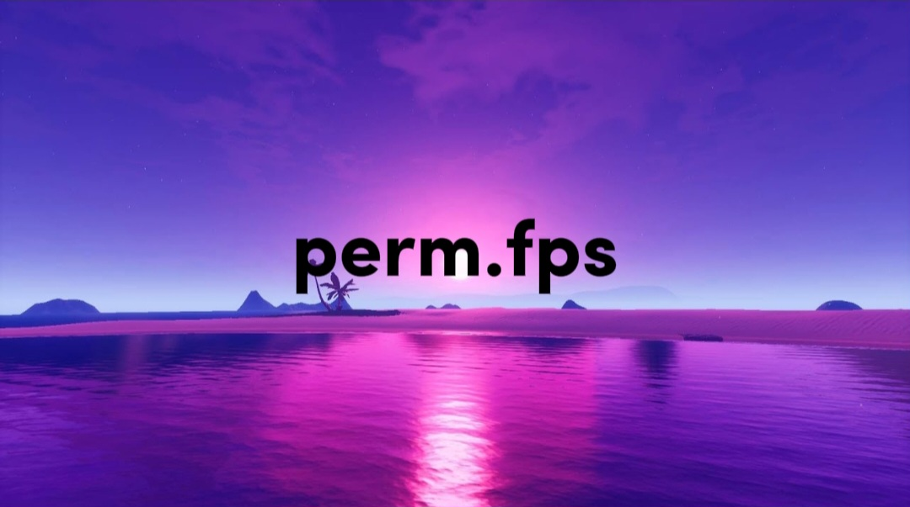

# perm.fps


Ths first ever server-side JavaScript code is created that allows you to update game settings, specifically the maximum FPS, through HTTP requests. It utilizes Node.js with Express.js and node-ffi to interact with a hypothetical game library.

## MIT License
**it's licensed under the MIT License.**

## Requirements

*- A Laptop or PC*
*- Node.js*
*- Express.js*
*- node-ffi*
*- ref-struct*

## Installation

1. Clone this repository:
2. Input the current file named **fps changer.js** into your laptop or PC.
3. Add it into your **VSCode** or into your shortcuts/apps.
4. Change your FPS to max or to anything you want.
5. Give the file be ran automatically with administration.

## Finish:
the code should look like this:
```js
const express = require('express');
const ffi = require('ffi');
const ref = require('ref');
const refStruct = require('ref-struct');

const app = express();
const PORT = process.env.PORT || 3000;

// Define the structure for the game settings
const GameSettings = refStruct({
    'maxFPS': 'int',
    // Add more settings here if needed
});

// Load the game library
const gameLibrary = ffi.Library('/path/to/game/library', {
    'setGameSettings': ['void', [GameSettings]]
});

// Middleware for parsing JSON
app.use(express.json());

// Route to handle POST request to update game settings
app.post('/settings', (req, res) => {
    const maxFPS = parseInt(req.body.maxFPS);

    // Create a new game settings object
    const settings = new GameSettings({
        maxFPS: maxFPS
    });

    // Call the function in the game library to update settings
    gameLibrary.setGameSettings(settings);

    // Send response
    res.send('Settings updated successfully.');
});

// Start the server
app.listen(PORT, () => {
    console.log(`Server listening on port ${PORT}`);
});
```

And you are ready to go! 
